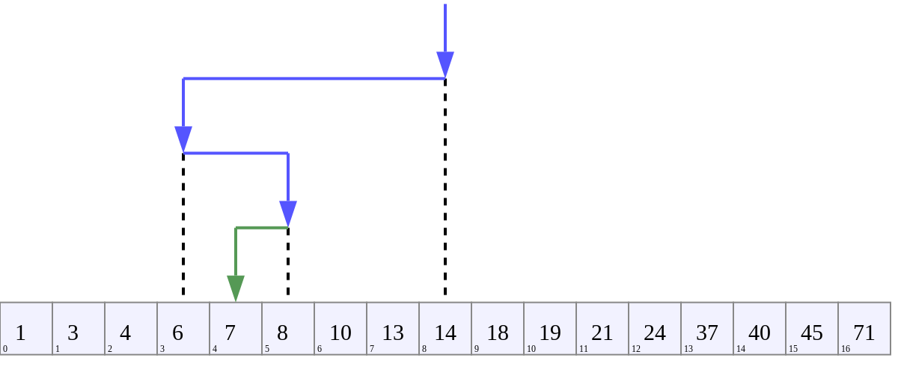

# Бинарный поиск

#### Бинарный поиск - это алгоритм поиска элемента в уже отсортированном массиве, при котором проверка начинается со среднего элемента и последовательно делит пополам массив для обнаружения необходимого элемента.

### Принцип работы алгоритма бинарного поиска:

1. Предварительно сортируем массив данных.
2. Делим массив пополам и находим средний элемент.
3. Сравниваем средний элемент с элементом, который необходимо найти. Если элемент найден прекращаем поиск .
4. Если элемент не найден и нужное нам число большое среднего, то ищем элемент в правой части массива, если меньше, то в левой.

#### Таким образом продолжаем дробить массив, пока не найдем нужный элемент.

### Ниже приведена реализация алгоритма бинарного поиска на Java в ранее отсортированном массиве: 

    public static int binarySearchRecursively(ArrayList<Integer> arr, int el){

        BubbleSorter.Sort(arr);

        int first = 0;

        int last = arr.size()-1;

            while(first<=last){
                int middle = (first+last)/2;

                   if(el== arr.get(middle))
                    return middle;

                  if(el< arr.get(middle))
                     last=middle-1;

                  if(el> arr.get(middle))
                     first = middle+1;
            }
        return 0;

    }