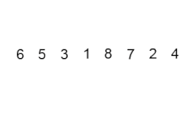

# Сортировка пузырьком
#### Сортировка пузырьком - это метод сортировки массива по возрастанию либо по убыванию, при котором сравниваются соседние элементы и меняются местами, если предшествующий оказывается больше последующего при сортировке по возрастанию, соответственно, если предшествующий оказывается меньше последующего при сортировке по убыванию .

Пример сортировки пузырьком: 

### Ниже приведена реализация алгоритма пузырьковой сортировки на Java: 

    public static void Sort(ArrayList<Integer> arr) {
        for (int i = 0; i < arr.size(); i++) {
            for (int j = 0; j < arr.size() - 1; j++) {
                if (arr.get(j) > arr.get(j + 1)) {
                    int k = arr.get(j + 1);
                    arr.set(j + 1, arr.get(j));
                    arr.set(j, k);
                }
            }
        }
    }

И вызов функции с данным алгоритмом: 

    public static void main(String[] args) {
        Scanner scan = new Scanner(System.in);
        System.out.println("Введите длину массива:");
        int length = scan.nextInt();
        ArrayList<Integer> array = new ArrayList<>(length);
        System.out.println("Введите элементы массива:");
        for(int i=0;i<length;i++){
            array.add(i, scan.nextInt());

        }
        System.out.println("Исходный массив: "+ array);
        BubbleSorter.Sort(array);
        System.out.println("Отсортированный массив: "+ array);
    }